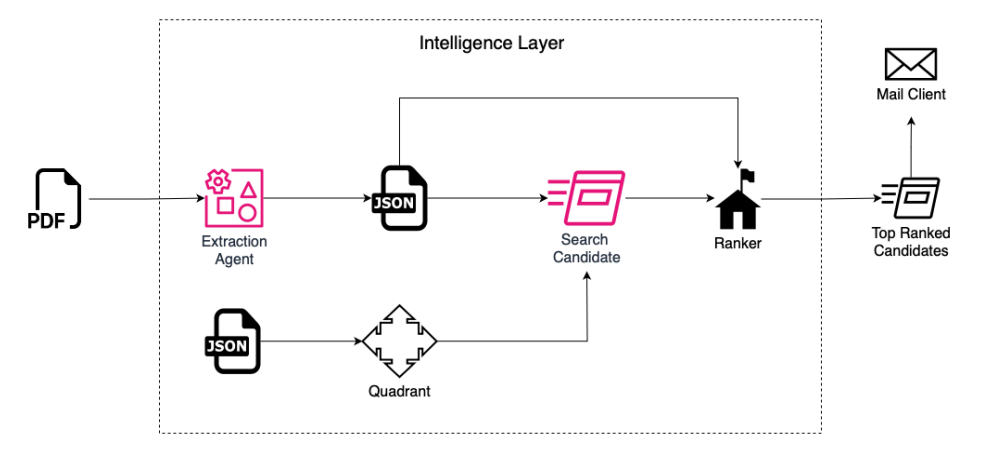

# Exxeta Challenge @ Q-Hack 2025

## 🤖 AI Staffing System with Multi-Agent AI

### 📄 Problem Statement:

In this hackathon, the challenge is to build a service or application that connects consultants with fitting projects using Multi-Agent AI Systems. Tech students are invited to explore how intelligent agent collaboration can bridge the gap between individual profiles and project needs, creating smarter, more dynamic connections.

Whether through **skill-based matching**, **smart recommendations**, or **automated coordination**, the goal is to let AI assist in establishing meaningful partnerships. The challenge encourages experimentation with agent roles and coordination strategies to create efficient and intelligent staffing processes.

---

### 🛠️ Application Overview:

A smart staffing platform designed to:

- Intelligently match consultants with relevant projects.
- Store consultant profiles and project descriptions in a structured database.
- Provide a user-friendly interface for both consultants and project owners to:
  - View match suggestions
  - Track application and project progress
  - Gain insight into the relevance and quality of matches

---

### ✅ Our Solution: AI-Driven Staffing Platform

An AI-powered staffing system that compresses a **week-long manual process into just a few clicks**.

#### 🚀 Key Advantages

- **FASTER TURNAROUND**  
  Shorten the staffing cycle from days to minutes. Start projects sooner and boost billable hours.

- **BETTER MATCHES**  
  AI can assess hundreds of profiles instantly, identifying matches a human might miss.

- **SCALABILITY**  
  As firms scale, manual staffing becomes a bottleneck. Our system handles growth seamlessly.

---

### 🔁 Workflow


<!-- Replace `workflow_image.png` with actual image name/path in your repo -->

---

## 🧪 Setup Instructions

Open two separate terminals to execute the **Frontend** and **Backend** setup processes.

### 🌐 Frontend Setup

1. **Change directory to the Frontend Folder:**

   ```bash
   cd /c/Users/49160/Downloads/QHack/frontend

2. **Install local npm dependencies:**
    ```bash
    npm install

3. **Start the development server:**
    ```bash
    npm run dev

4. **Visit the provided URL to access the frontend application.**

### 🌐 Backend Setup

1. **Change directory to the Backend Folder:**
    ```bash
    cd /c/Users/49160/Downloads/QHack/backend

2. **Create a Python virtual environment:**
    ```bash
    python -m venv env

3. **Activate the virtual environment:**
    ```bash
    env\Scripts\activate

4. **Install dependencies from requirements.txt:**
    ```bash
    pip install -r requirements.txt

5. **Execute the API controller file:**
    ```bash
    python api_controller.py

### 💡 Final Notes

- Ensure you have **Python** (version ≥ `3.10.0'), **Node.js** (version ≥ `v18.14.1`), and **npm** (version ≥ `9.3.1`) installed on your system.
- Keep both **frontend** and **backend** terminals running during development.
- You may adjust the **folder paths** if your local directory structure is different.

### 🎯 Closing Statement
This project showcases how intelligent agents can revolutionize the staffing process—making it faster, smarter, and more scalable. By leveraging Multi-Agent AI, we take a bold step toward the future of work. Let’s build systems that not only connect people to projects, but empower them to thrive.
